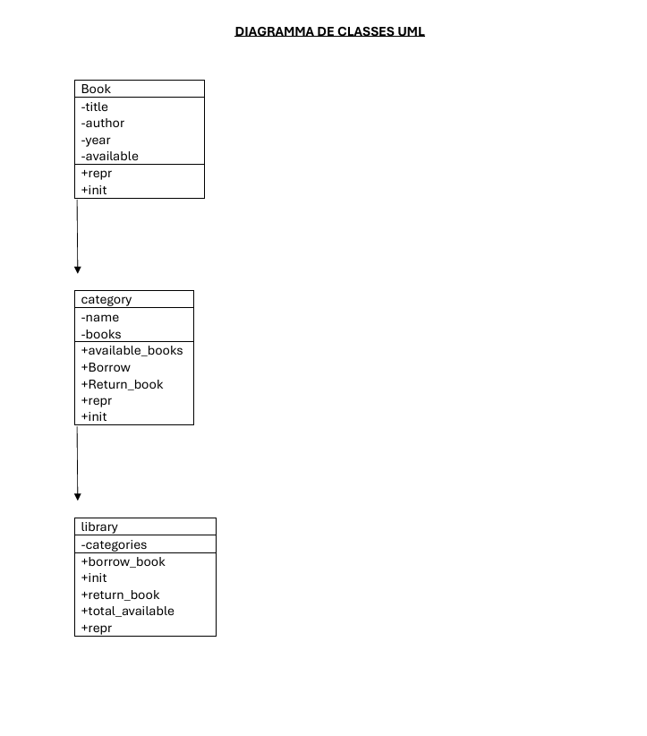

# Gestion de bibliothèque numérique
## Informations
**Réalisé par:** TATY MASSANGA PETINIA MICHELLE (*Travail individuel*)
**Module:**  programmation orientée objet

## description du projet
Ce projet est un système de gestion pour une bibliothèque. Le but, c'est de pouvoir organiser  proprement des livres par catégorie, voir lesquels sont disponibles ou empruntés, et les gérer. Dans ce projet, il ne m'est pas demandé de faire une interface graphique, juste du code Python bien structuré qui pourrait être utilisé plus tard.
### objectifs
-organiser les livres par catégorie
-vérifier la disponibilité des livres
-gérer les emprunts et les retours
-Afficher des statistiques simples

## architecture du projet
### structure des fichiers

PROJET_BIBLIOTHEQUE/

1. bibliotheque/
   A. main.py
   B. Book.py
   C. Category.py
   D. Library.py
   E. books.csv

2. README.md
3. uml.png
4. .gitignore

### diagramme de classes uml


## Principes de conception
### Responsabilités
**book** : Représenter les données d'un livre avec validation
**category** gérer un ensemble de livres appartenant à une même catégorie
**library** coordonner l'ensemble des catégories et fournir une interface globale

*chacune de ces classes a une responsablilité précise et unique*


### Gestion des exceptions

Les classes **lèvent des exceptions** (*raise*) lorsqu'une opération est impossible
La gestion des erreurs (*try/except*) est effectuée **uniquement dans le programme principal**
Les classes métier ne contiennent pas de *print()* pour respecter la séparation des responsabilités

### fichier **books.csv**

Les livres sont stockés dans `books.csv` avec ce format :

Catégorie;Titre;Auteur;Année;Disponible

**Traitement des données :**

 ***Nettoyage*** : Suppression des espaces inutiles
 ***Conversion*** : Transformation de l'année en entier (int)
 ***Conversion*** : Transformation de `yes/no` en booléen (`True/False`)
 ***Validation*** : Les lignes invalides ou incomplètes sont ignorées

 ## utilisation
 ### Prérequis
Python 3.8 ou version supérieure
Aucune bibliothèque externe requise
### Lancement
```bash
python main.py
```

**Fonctionnalités testées :**

Le programme principal démontre les fonctionnalités suivantes :
1. Charger des données depuis le CSV
2. Afficher les statistiques initiales
3. Faire un test d'emprunt
4. Essayer d'emprunter un livre déjà pris (pour tester les erreurs)
5. Rendre le livre
6. Afficher les statistiques finales

### exemple de sortie

GESTION DE LA BIBLIOTHÈQUE MUNICIPALE

 5 catégories
   - Roman: 10 livre(s)
   - Théâtre: 10 livre(s)
   - Philosophie: 10 livre(s)
   - Science: 10 livre(s)
   - Histoire: 10 livre(s)

Nombre total de livres dans la bibliothèque: 50
 total de livres disponibles: 32
Livres empruntés: 18

Emprunt d'un livre  dans la catégorie 'Roman'...
  Livre emprunté avec succès!

Total de livres disponibles: 31

Tentative d'emprunt (d'un livre déjà emprunté)
   Erreur attendue: le livre 'Madame Bovary' est déjà emprunté

 Recherche du livre pour le retour...
 Retour du livre 'Madame Bovary'...
   Livre retourné avec succès!

Nombre total de livres disponibles: 32

STATISTIQUES PAR CATÉGORIE
Roman: 6/10 disponibles
Théâtre: 7/10 disponibles
Philosophie: 6/10 disponibles
Science: 6/10 disponibles
Histoire: 7/10 disponibles

## Points techniques

### La classe Book

eprésente un livre avec ses attributs et valide les données lors de la création.

**Exceptions possibles :**
- `ValueError` : Titre vide, auteur vide, année invalide
- `TypeError` : Types de données incorrects
### La classe Category

Elle gère tous les livres d'une catégorie. Les méthodes importantes :
- `available_books()` : renvoie seulement les livres disponibles
- `borrow(titre)` : emprunte un livre
- `return_book(livre)` : rend un livre

**Exceptions possibles :**
- `ValueError` : Livre inexistant dans la catégorie
- `RuntimeError` : Livre déjà emprunté


### La classe Library

Coordonne l'ensemble des catégories et fournit une interface globale.

**Méthodes principales :**
- `borrow_book(category_name, title)` : Emprunte un livre dans une catégorie
- `return_book(category_name, book)` : Rend un livre dans une catégorie
- `total_available()` : Calcule le nombre total de livres disponibles

**Exceptions possibles :**
- `ValueError` : Catégorie inexistante

## Compétences développées

Ce projet m'a permis de travailler sur :
- L'utilisation de la programmation orientée objet
- La séparation des responsabilités entre les classes
- Le découplage du code avec l'injection de dépendances
- La gestion appropriée des exceptions
- Le nettoyage et le contrôle de données venant d'un CSV

---

**MERCI !!**